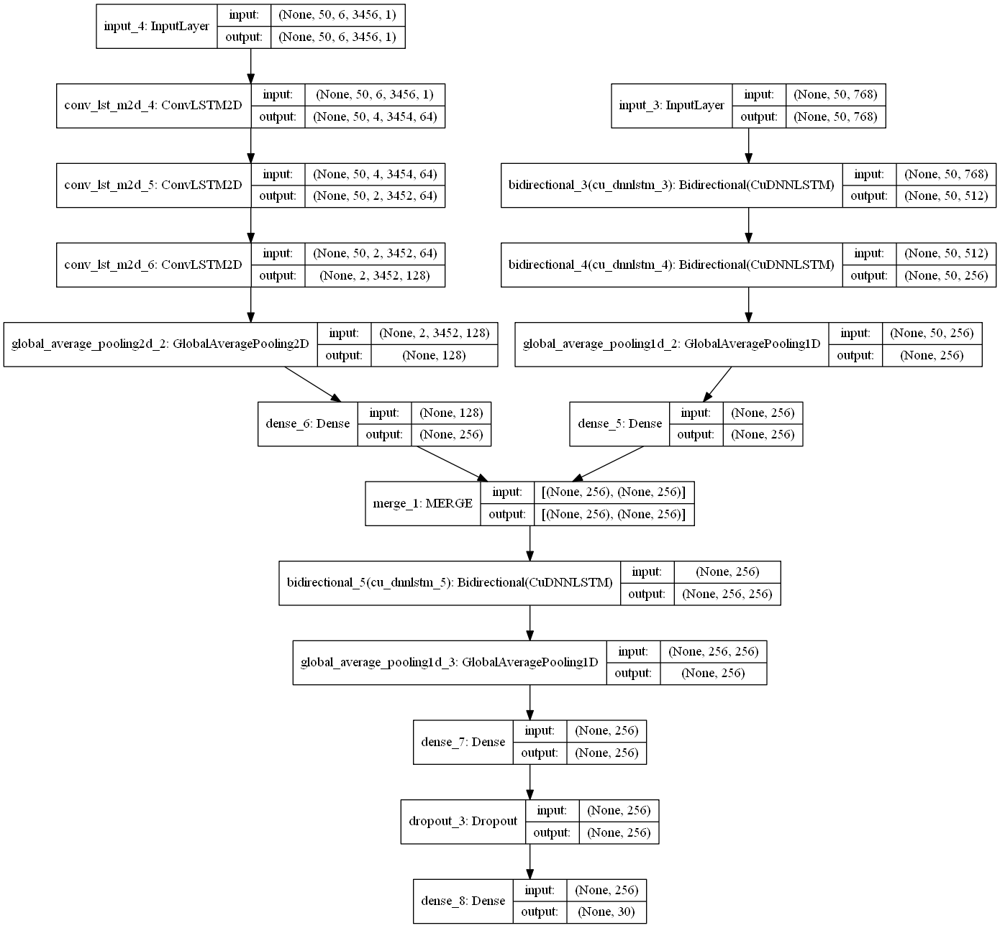

# Stock Price Prediction Using Multi-Modal Features (Audio + Text Transcripts)
Made as part of the Interview Assignment For RA Position at IIIT-Delhi MIDAS Labs.
(I got selected, but due to some unfortunate circumstances at my then workplace, i wasn't able to continue.)

###### Data
The data consists of the audio recordings of quarterly board performance meetings where the stock performance of publically traded companies is announced and predictions for future performance are made. The data also consists of the text transcripts of the same meetings. The target is the stock prices for the next 30 days.

* The audio and text data is the dataset mentioned in the paper, consisting of a total of 575 meetings with subsequent audio and text transcripts.

* The paper mentions the use of CSRP data for the stock prices as the target, but i used the data from the yahoo finance website. The adjusted closing prices is used as the target.

* The data contains audio files for each sentence in the transcript.

###### Approach

The problem statement is a multimodal approach for stock prices prediction, Relying on the correlation between, text and audio data. The main study is of taking the sentiment queues from the audio data and the contextual information from the text and learning a joint representation for accurate prediction of stock prices.

* To obtain the certain speech features from the audio, i used a pretrained speech sentiment classifier and took the last hidden layer activations as the input feature representation for the audio. The speech sentiment classifier uses MFCC features as input and uses convolutional filters to learn the embeddings for speech.
* To obtain the word embeddings for the text data, i used a pretrained BERT model. Instead of using pretrained glove encodings, i went for BERT because of it's ability to learn context information within the embeddings.
* The sentences from the text transcript are padded to be of same length and are converted to sequences through the BERT embeddings. These embedded sentence sequences serve as the input features for the text data.
 * Each of the text and audio input features are passed through a BiLSTM Layer with an attention head to produce the within modality encodings.
 * To learn the correlation between modalities, both encodings are concatenated and are passed through a BiLSTM layer which produces the combined encoding of both modalities.
 * These encodings are then passed through a feed forward layer with a dropout regularizer.
 * Finally this is passed through a regression layer that predicts the next 30 days of stock prices.
 * I compare 3-day, 7-day, 15-day and 30-day activations for generating the scores.

The scores are generated according to the formula for stock volatility mentioned in the paper :

${MSE = \frac{1}{M}\sum_{i=1}^{M}(f(X_{i}) - y_{i})^{2}}$

Where $f(X_i)$ is the predicted volatility and $y_i$ is the tru volatility for example $i$.

And volatility is defined as :
$v_{[t-\tau, t]} = \ln(\sqrt{\frac{\sum_{i=0}^{\tau}(r_{t-i} - \bar r)^2}{\tau}})$

where $r_t$ is the return price at day $t$ and $\bar r$ is the mean of the return price over the period of day $t − τ$ to day $t$.

and return price is defined as $r_t = \frac{P_t}{P_{t-1}}-1$

where $P_t$ is the closing price on day $t$

###### Model

###### Further improvements
1. Instead of directly concatenating the audio and text encodings, use the approach similar to the [paper](https://arxiv.org/pdf/1911.05544.pdf).
2. Use a better speech encoder like [pase](https://arxiv.org/abs/1904.03416).
3. The documents contain 3 different types of statements, generatl statements, past or current performance, future ambitions and predictions, these statements can be modelled separately to learn weighted features from each type of statement and utilize it to perform prediction and to get better insight how the speech queues affect the prediction.
###### References
###### Usage
1. Clone the repo.
2. Make a data folder in the root.
1. Download the data from the [link](https://drive.google.com/file/d/15wtWZvSJicF_Ur2V45lCyCjNJQ7QfXth/view) mentioned in the paper.
2. Extract the data and move it to the features folder in the data folder.
3. Run the script prepare_data.py : it'll create train, validation and test folders, convert the mp3 audios to wav files, and download the yahoo finance data.
4. Run the training using train.py
5. To predict, pass the directory where the data is stored and run test.py

###### Results
<table><thead>
<tr>
<td colspan=5><code class="prettyprint"><b>MSE Scores</b></code></td>
</tr>
<tr>
<th>Model</th>
<th>3-days</th>
<th>7-days</th>
<th>15-days</th>
<th>30-days</th>
</tr>
</thead><tbody>
<tr>
<td>Paper</td>
<td>1.371</td>
<td>0.420</td>
<td>0.300</td>
<td>0.217</td>
</tr>
<tr>
<td>Past Volatility</td>
<td>1.389</td>
<td>0.517</td>
<td>0.292</td>
<td>0.254</td>
</tr>
<tr>
<td>Text only</td>
<td>1.879</td>
<td>0.503</td>
<td>0.373</td>
<td>0.279</td>
</tr>
<tr>
<td>Audio only</td>
<td>4.389</td>
<td>9.138</td>
<td>11.242</td>
<td>12.256</td>
</tr>
<tr>
<td>Multimodal</td>
<td>TBD</td>
<td>TBD</td>
<td>TBD</td>
<td>TBD</td>
</tr>
</table>
